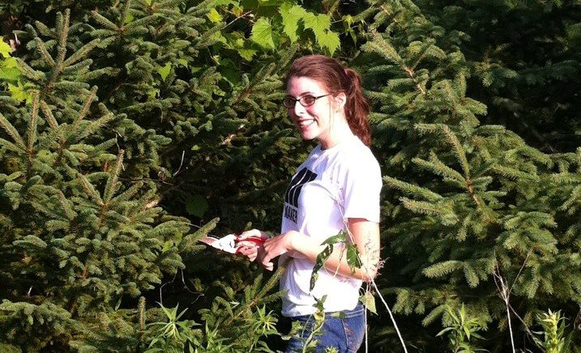

The Conservation Reserve Program (or CRP) is administered by the Farm Service Agency and is funded by the Farm Bill. This program offers yearly rental payment to farmers, and, in exchange, farmers take environmentally sensitive land out of production and grow plants that can bolster the surrounding ecosystem. Farmers can sign contracts 10-15 years in length and are usually paid based on the dryland crop rent rate, meaning whatever someone could earn renting the land for growth of non-irrigated crops (like wheat, corn, etc.). The program targets land for things like wetland restoration, pollinator habitats, and erosion control.

A version of the CRP program began in the 1950s, but it really took off when President Ronald Reagan signed the 1985 Farm Bill. CRP has gone through many changes, but at its core it is working to build up ecosystems in rural, agricultural areas. The USDA and other federal agricultural agencies have cited tons of benefits, especially decreased soil erosion. This is huge! [If you have ever heard me talk about soil](http://12go.onetogrowonpod.com/2018/10/23/2-soils/), you’ll know I think it is critically important. It can take thousands of years to form a few grams of soil, and believe it or not soil is crucial to human existence. When we lose soil to erosion, we are fundamentally losing something that will take millenia to restore.

I felt slightly abashed when I said in the episode that I didn’t know about any voluntary conservation programs. I have actually worked on a farm that had land in CRP! Here is a photo.

I think CRP rocks and could definitely be expanded. But, I think it is important to find ways to incorporate ecologically beneficial practices in land that is actively in-production as well. This can include things like not tilling fields, breaking up field contiguity with perennial native plant stands (patches of trees), or cutting down on broad-spectrum pest control.

